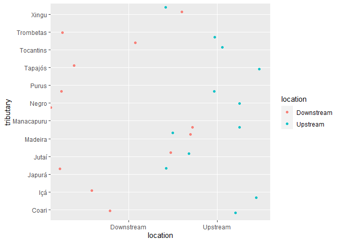

Lab 6 Comparing two means
================
Lara Al Selim
04.29.2021

Researchers studying the number of electric fish species living in
various parts of the Amazon basin were interested in whether the
presence of tributaries affected the local number of electric fish
species in the main rivers (Fernandes et al. 2004).

They counted the number of electric fish species above and below the
entrance point of a major tributary at 12 different river locations.

The data is provided in your GitHub repository.

For each question below, write a sentence answering the question and
show the code you used to come up with the answer, if applicable.

``` r
library(tidyverse)
```

    ## -- Attaching packages --------------------------------------- tidyverse 1.3.0 --

    ## v ggplot2 3.3.3     v purrr   0.3.4
    ## v tibble  3.0.4     v dplyr   1.0.2
    ## v tidyr   1.1.2     v stringr 1.4.0
    ## v readr   1.4.0     v forcats 0.5.0

    ## -- Conflicts ------------------------------------------ tidyverse_conflicts() --
    ## x dplyr::filter() masks stats::filter()
    ## x dplyr::lag()    masks stats::lag()

``` r
fish <- read_csv("chap12q19ElectricFish.csv")
```

    ## 
    ## -- Column specification --------------------------------------------------------
    ## cols(
    ##   tributary = col_character(),
    ##   speciesUpstream = col_double(),
    ##   speciesDownstream = col_double()
    ## )

``` r
fish_long <- 
  pivot_longer(fish, speciesUpstream:speciesDownstream,
               names_to = "location",
               values_to = "species") %>% 
  mutate(location = str_remove(location, c("species"))) %>% 
  print()
```

    ## # A tibble: 24 x 3
    ##    tributary location   species
    ##    <chr>     <chr>        <dbl>
    ##  1 Içá       Upstream        14
    ##  2 Içá       Downstream      19
    ##  3 Jutaí     Upstream        11
    ##  4 Jutaí     Downstream      18
    ##  5 Japurá    Upstream         8
    ##  6 Japurá    Downstream       8
    ##  7 Coari     Upstream         5
    ##  8 Coari     Downstream       7
    ##  9 Purus     Upstream        10
    ## 10 Purus     Downstream      16
    ## # ... with 14 more rows

## Question A

> Test the hypothesis that the tributaries have no effect on the number
> of species of electric fish.

``` r
fish_ttest <- t.test(species ~ location, data = fish_long)
diff(fish_ttest$estimate)
```

    ## mean in group Upstream 
    ##              -1.833333

ANSWER The Null hypothesis is that the tributaries have no effect on the
number of species of electric fish, and the Alternate hypothesis is that
the tributaries do have an effect on the number of species of electric
fish.

## Question B

> What is the difference in the mean numbers of species between areas
> upstream and downstream of a tributary? What is the 95% confidence
> interval of this difference in means?

ANSWER The difference in the mean numbers of species between areas
upstream and downstream of a tributary is -1.83 and the true difference
in means is between -4.59 and 8.25.

## Question C

> State the assumptions that you had to make to complete parts (A) and
> (B). Create a graph to assess whether one of those assumptions was
> met.

ANSWER The assumption was that the tributaries had no effect on the
number of species of electric fish.

``` r
fish_long %>% 
  ggplot(aes(x = location, y = tributary)) +
  geom_jitter(aes(color = location), 
  shape = 16, alpha = 0.9, width = 0.9) 
```

<!-- -->
